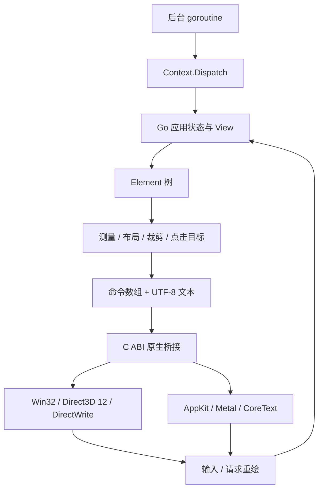

# 架构

应用调用 `Run(options, view)`，操作系统事件循环驱动 Go 回调。窗口尺寸、文本位置和布局统一使用设备无关像素，原生后端负责映射到物理像素。

## 状态与线程

应用状态保存在 Go 闭包或业务对象中。`view` 和按钮回调仅由 UI 线程调用；状态改变后，下一帧重新建立元素树。这是声明式视图与持久应用状态的组合，尚无框架管理的 Entity、订阅或依赖跟踪。

`Context.Dispatch` 使用受互斥锁保护的队列，平台唤醒操作异步进入事件循环。UI 线程在下一帧开始时取走队列并执行；执行过程中再次 `Dispatch` 的任务留给下一帧。框架不对业务状态加锁，应用应通过该队列修改后台结果。

macOS 在包初始化时锁定启动 OS 线程，`Run` 必须从 `main` goroutine 调用，原生桥接也会检查主线程。Windows 在 `Run` 期间锁定调用 OS 线程并初始化 COM STA。当前进程只能同时运行一个窗口。用户回调的 panic 转换为错误并请求关闭窗口。

## 测量与布局

文本由 DirectWrite 或 CoreText 测量，不按字节数估计宽度。Go 的文本尺寸缓存和原生文本布局/纹理缓存均限制条目数为 1024，超出后清空；不是按总字节计费，超长文本仍会占用较多内存。

每帧先测量元素，再沿 Row / Column 主轴分配空间。`Grow` 将剩余空间按权重增加到元素的固有尺寸，`Flex` 从零基准分配，适合固定标题栏/状态栏中间的工作区；不执行 flex shrink。交叉轴默认拉伸，显式尺寸限制该方向。父级内边距与裁剪决定可见区域和可点击区域。文本是单行，溢出按父级区域裁剪。字体名称也参与测量和原生布局缓存的键。

点击仅在按下和释放落于同一稳定键对应的按钮时触发。失去捕获或窗口焦点会取消按下状态。交互元素的 `Key` 必须唯一，否则返回 UI 回调错误。未指定键时采用元素路径，动态列表应显式设置键。

## 原生桥接与渲染

`internal/platform/bridge.h` 定义固定布局的绘制命令、矩形、颜色和事件 ABI。每帧通过 C 分配的命令数组与 UTF-8 文本块提交，原生侧同步复制，调用结束后 Go 释放临时块。原生代码不保留 Go 指针。后台唤醒和退出不读取 Go 状态。

Windows 使用默认 Direct3D 12/DXIL 管线、三个 BGRA flip swapchain 缓冲和 DXGI frame-latency waitable object。消息与显示时钟通过 MsgWaitForMultipleObjectsEx 协同等待，每帧先确认显示时钟和该槽 fence，再复用 allocator、实例上传内存与描述符。空闲时不提交帧；Dispatch/输入/恢复重新请求绘制。缩放只在尺寸变化时排空队列并重建 swapchain 缓冲，DPI 参与字形缓存键。设备丢失目前返回明确错误，自动重建仍待实现。

DirectWrite 对文本整形，然后按 font face/glyph/size/scale/方向与测量模式缓存独立字形的 R8 覆盖率。1024×1024 图集页采用带边距的 shelf packing，活动缓存最多 16 页/16384 字形；清空旧缓存时，在途帧仍通过 shared_ptr 保留所需页面。包括三个在途代数和当前代数，页面峰值限制按 64 MiB 验收；每页另有同尺寸 CPU 镜像，提交槽持有上传暂存直到 fence 完成。纹理更新与绘制在同一 GPU 队列中按资源屏障排序，不覆盖 GPU 正在读取的上传数据。

macOS 14+ 使用 CAMetalDisplayLink 的显示同步回调和直接提供的 drawable，MTKView 自动绘制循环停用。重复重绘请求合并为 dirty 状态，每次回调最多绘制一帧；无 dirty 状态时暂停时钟，Dispatch、输入及窗口恢复重新唤醒。macOS 13 兼容路径使用 MTKView 的显示同步循环，诊断中的 frame clock 明确区分两个路径。两者都不使用无节奏的 setNeedsDisplay 链。

每个 80 字节实例在顶点着色器中产生六个三角形顶点；圆角矩形/线段通过距离函数着色，父级裁剪在片元着色器中执行。保持画家顺序，只有需要更换文本纹理时才分开相邻批次，几何命令可继续沿用当前绑定的纹理。CoreText 仍将整段文本光栅化为缓存纹理，缓存同时限制到 1024 项/16 MiB；单个光栅也限制到 16 MiB，尚无共享字形图集。

Metal 的三个上传缓冲分别拥有原子 busy 状态，完成回调释放该帧的缓冲；UI 线程不会覆盖 GPU 尚在读取的内存。提交环饱和时记录待重绘状态，由完成回调再请求绘制，正常帧不等待 GPU。只在窗口退出时有界地排空提交。每个缓冲限制到 16 MiB，空场景仍提交清屏。完成回调同时更新实际完成计数；窗口代数阻止超时关闭后的旧回调污染下一次 Run。

`internal/platform.RendererStats` 区分实际提交和 GPU 完成，并报告最后一帧的实例数、draw call、实例上传字节和 CPU/GPU 耗时。Windows 快照用互斥锁复制，Metal 字段按原子分别读取；跨两次调用不能当作同一事务或输入延迟测量。字形诊断另报光栅化/命中/条目数、活动和在途图集页面字节、峰值、淘汰代数以及累计图集上传量。

帧 CPU 时间采用单调时钟的实际经过时间，包含 Go 视图/布局与传输、drawable 获取和提交编码三个阶段；不是线程 CPU 占用。压力报告分别保存阶段 P95，以区分布局开销、等待呈现资源和编码开销，各阶段最后一帧的时间之和必须等于总时间。

CAMetalDisplayLink 在进入回调前提供 drawable，acquire 阶段只计渲染附件配置，系统在回调前的调度时间不在该 CPU 指标中。压力测试还断言多次请求被合并、空闲时停止提交及回调、Dispatch 后重新绘制，完整报告随 Mac CI artifact 保存。

Windows 的 `internal/dx12test` 使用与窗口相同的设备/PSO 创建代码，另行验证离屏 D3D12/DXIL 管线。每个帧槽拥有独立的 allocator、上传缓冲、离屏 render target 和 readback buffer，fence 完成前禁止复用。合成 R8 纹理和八个实例检查片元裁剪、预乘 alpha、几何、画家顺序与 CPU/GPU ABI。queue gate 强制三帧在途，再验证第四次提交被推迟及原有帧数据未受覆盖。

原生窗口集成测试设置 `GODESKTOP_READBACK=1`，在同一窗口 D3D12 队列中复制实际 swapchain 像素，完成 fence 后写入只包含该 HWND 客户区的测试映射。消费者核对 PID/HWND、后端属性、尺寸和前后序列号；不会读取桌面或用 GDI 输出代替。普通运行不创建该映射，也不复制窗口像素。硬件和 WARP 都使用相同后端；gocode 的发布依赖仍需升级，详见 [GPU 验收](rendering-modernization.md)。

## 边界

`WindowOptions.Input` 在 UI 线程接收按键、Unicode scalar、指针和滚轮；返回 true 表示消费事件。应用维护编辑/滚动状态，框架尚无通用输入框或滚动容器。Windows 处理 UTF-16 surrogate pair，macOS 处理 NSEvent 字符；没有实现 IME 组合文本协议。自定义标题栏的 Draggable 区域映射系统拖动，边框命中保留 Windows 缩放，最大化限制到显示器工作区域。

当前没有多窗口、完整 IME、图片、剪贴板、拖放、辅助功能、动画时钟、虚拟列表、完整 flex 布局或应用打包。性能定位是设计目标，不能用基础布局 benchmark 推导完整应用的性能。
